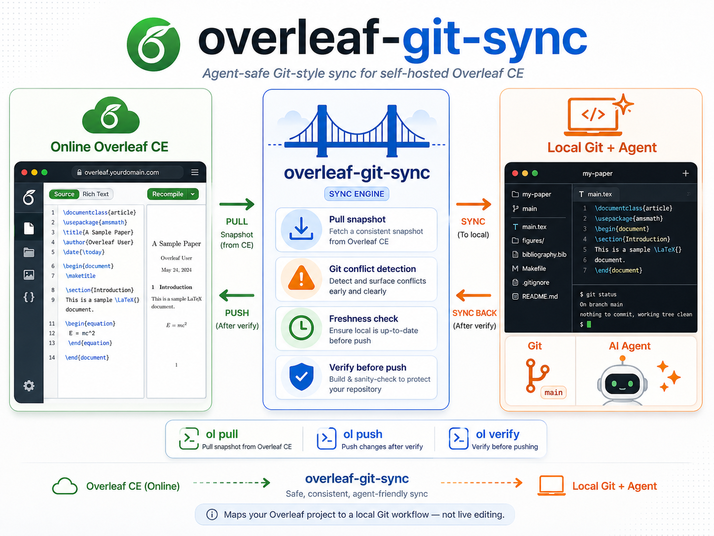

# overleaf-git-sync

把在线 Overleaf 项目映射成一个本地 Git 工作仓库。



这个项目把本地 Git 当作本地编辑器和 Overleaf 之间的安全层：

- 先拉取远端快照到本地
- 再在本地 Git 仓库里修改、提交
- 推送前再次拉取远端最新状态
- 如果 Git 发现冲突，就停止，不静默覆盖远端修改

它不是 Overleaf 官方 Git 集成的替代品，也不实现 Git 协议服务器。

## 当前提供的功能

- `ol auth login`：保存一个已登录的 Overleaf 会话到 `.ol-sync/session.json`
- `ol init`：初始化当前目录的同步配置，并绑定到一个 Overleaf 项目
- `ol pull`：导入远端最新快照，并把变更放到暂存区等待确认
- `ol push`：先做 freshness check，再把已提交的本地改动推回 Overleaf
- `ol push --fast`：跳过 freshness pull，适合你确认本地远端快照已是最新时使用
- `ol status`：查看当前分支、同步元数据和本地改动概览
- `ol verify`：下载远端最新快照，并和本地目录做逐文件对比

## 安装

先把工具安装到一个虚拟环境里。安装完成后，只要激活这个环境，就可以在**任意**
Overleaf 项目目录里直接使用 `ol`，不需要停留在当前仓库目录。

在本仓库根目录执行：

```bash
uv venv --python 3.13
uv pip install -e .
source .venv/bin/activate
ol --help
```

激活后，`ol` 会在当前 shell 的 `PATH` 里可用。典型用法是：

```bash
cd /path/to/overleaf-git-sync
source .venv/bin/activate
cd ~/papers/my-paper
ol auth login --host http://localhost --email you@example.com
```

## 完整上手流程

下面演示一遍从空文件夹开始，到登录、初始化、本地修改、提交、推送的完整过程。

### 1. 登录 Overleaf

先在本地项目目录里登录。登录后，session 会保存到 `.ol-sync/session.json`，后续
`ol init` 会直接复用这里面的 host，所以通常不需要再传 `--host`。

如果你用的是本地 Docker 部署或自托管 Overleaf，通常直接用密码登录最省事：

```bash
mkdir -p ~/papers/my-paper
cd ~/papers/my-paper
ol auth login --host http://localhost --email you@example.com
```

如果你用的是官方 Overleaf（`https://www.overleaf.com/`），目前更推荐先在网页端登录，
再直接复用浏览器 Cookie。常见可用的 key 是 `overleaf_session2=...`：

```bash
ol auth login --host https://www.overleaf.com --cookie 'overleaf_session2=...'
```

### 2. 初始化本地同步仓库

```bash
ol init --project-id YOUR_PROJECT_ID --project-name my-paper
```

这一步会：

- 创建 `.ol-sync/config.toml`
- 创建或补充 `.gitignore`
- 如果当前文件夹**还没有自己的 `.git`**，自动执行 `git init`
- 下载远端项目初始快照
- 建立 `overleaf-remote` 分支并合并到本地工作分支

如果当前目录已经有 `.ol-sync/config.toml`，`ol init` 默认会覆盖它；传
`--keep-config` 可以保留原配置。

### 3. 拉取远端最新修改

在开始编辑前，先拉一次：

```bash
ol pull
```

`ol pull` 不会直接替你生成 merge commit。它会把远端变更放到暂存区，你确认后自己提交：

```bash
git diff --cached
git commit -m "overleaf: import latest remote snapshot"
```

如果没有新的远端修改，`ol pull` 会直接结束。

### 4. 本地修改并提交

现在可以在本地编辑论文文件，比如：

```bash
$EDITOR main.tex
git diff
git add -A
git commit -m "agent: revise introduction"
```

### 5. 推送回 Overleaf

先看推送计划：

```bash
ol push --dry-run
```

确认没问题后正式推送：

```bash
ol push
```

`ol push` 会先自动做一次 freshness pull。如果远端在你编辑期间又变了，它会先停下来，
要求你处理新的暂存变更或冲突，而不是直接覆盖 Overleaf。

如果你明确知道当前项目只有你一个人在改，并且本地的 `overleaf-remote` 已经是最新的，
可以用更快的模式直接跳过 freshness pull：

```bash
ol push --fast
```

`--fast` 会跳过推送前的远端刷新检查，但仍然保留本地工作区检查和推送后的远端验证。

### 6. 查看状态或校验

查看当前同步状态：

```bash
ol status
```

校验本地和远端是否一致：

```bash
ol verify
```

## 配置文件示例

初始化后会生成 `.ol-sync/config.toml`，大致如下：

```toml
[project]
host = "http://localhost"
project_id = "YOUR_PROJECT_ID"
project_name = "my-paper"

[backend]
type = "http"

[auth]
session_file = ".ol-sync/session.json"
```

## 配合 Agent 使用

如果你希望本地 coding agent 帮你一起修改论文，也可以把本仓库里的 `SKILL.md`
 一并提供给 agent。这个文件专门说明了怎样安全地使用 `ol` 命令，包括什么时候先
 `ol pull`、怎样处理暂存区里的远端变更、以及怎样在不覆盖 Overleaf 新修改的前提下
 推送回去。

## 安全原则

- 不直接修改 Docker volume、MongoDB、Redis 或 Overleaf 编译缓存
- 不做字符级实时同步
- 不绕过 Git 做自定义合并
- 推送前必须重新拉取远端快照
- 有冲突就停
- 写回后必须重新验证远端结果

最高优先级是不让陈旧的本地输出静默覆盖 Overleaf 上的新修改。

## 开发这个工具时才需要的命令

如果你是在开发 `overleaf-git-sync` 本身，而不是只把它拿来同步论文，可以再安装
开发依赖：

```bash
uv venv --python 3.13
uv pip install -e ".[dev]"
.venv/bin/python -m pytest
.venv/bin/ruff check .
.venv/bin/ol --help
```
